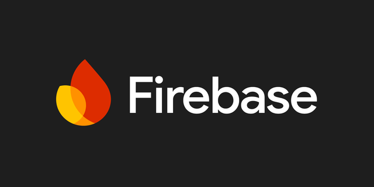

# Note-Taking App with Firebase Integration

A simple and secure note-taking app built with **Flutter** and **Firebase**. Create, edit, and delete notes that sync across devices. Perfect for organizing your thoughts on the go!

&nbsp;
---

*(Preview Screenshots will be placed here)*

---
&nbsp;


&nbsp;&nbsp;&nbsp;&nbsp;&nbsp;


&nbsp;

---
&nbsp;

## Features

- **📝 Create & Manage Notes**: Add, edit, and delete notes with ease.
- **🔐 Secure Login**: Sign up and log in using email/password with **Firebase Authentication**.
- **☁️ Cloud Sync**: Notes are saved in **Firestore** and synced across devices.
- **🔍 Search Notes**: Quickly find notes by title or content.
- **🌙 Dark Mode**: Switch between light and dark themes for comfortable reading.
- **🚀 Fast & Responsive**: Built with Flutter for smooth performance on Android and iOS.

---
---
&nbsp;

## How to Use

1. **Sign Up**: Create a new account using your email and password.
2. **Log In**: Log in to access your notes.
3. **Add Notes**: Tap the "+" button to create a new note.
4. **Edit Notes**: Tap a note to edit its title or content.
5. **Delete Notes**: Swipe or tap the delete icon to remove a note.
6. **Search**: Use the search bar to find specific notes.
7. **Dark Mode**: Toggle the theme using the icon in the app bar.

---
---
&nbsp;

## Installation

> ### Prerequisites
- Flutter SDK (version 3.0.0 or later)
- Firebase account (for backend setup)

> ### Steps
1. **Clone the Repository**:
   ```
   git clone https://github.com/<your-username>/note-taking-app.git
   cd note-taking-app
   ```

2. **Install Dependencies**:
   ```
   flutter pub get
   ```

3. **Set Up Firebase**:
   - Create a Firebase project at [Firebase Console](https://console.firebase.google.com/).
   - Enable **Email/Password Authentication** and **Firestore Database**.
   - Download your Firebase config files:
     - `google-services.json` (for Android)
     - `GoogleService-Info.plist` (for iOS)
   - Place these files in:
     - Android: `android/app/`
     - iOS: `ios/Runner/`

4. **Run the App**:
   ```
   flutter run
   ```

---
---
&nbsp;

## Folder Structure

```
lib/
├── models/           # Data models (e.g., Note)
├── views/            # UI screens (Login, Home, Add/Edit Note)
├── view_models/      # Business logic (AuthProvider, NotesProvider)
└── main.dart         # App entry point
```

---
---
&nbsp;

## Technologies Used

- **Flutter**: For building the app's UI and logic.
- **Firebase Authentication**: For secure user login and signup.
- **Cloud Firestore**: For storing and syncing notes.
- **Provider**: For state management (authentication, notes, theme).
- **MVVM Architecture**: For clean and organized code.

---
&nbsp;

## Troubleshooting

- **Blank Screen**: Ensure Firebase is properly initialized and Firestore rules allow read/write access.
- **Authentication Issues**: Verify Email/Password authentication is enabled in Firebase Console.
- **Dependency Errors**: Run `flutter clean` and `flutter pub get`.

---
&nbsp;

## Future Improvements

- **Note Categories**: Organize notes into categories (e.g., Work, Personal).
- **Offline Support**: Sync notes when the device is back online.
- **Rich Text Editing**: Add support for bold, italics, and bullet points.

---
&nbsp;
&nbsp;

## Credits

- **Flutter Bootcamp 2025**

---
&nbsp;

## Screenshots

*(screenshots of app will appear here)*

---
&nbsp;
&nbsp;
&nbsp;

Enjoy taking notes! 🚀  
*For questions or feedback, open an issue or contact me through my provided email.*
